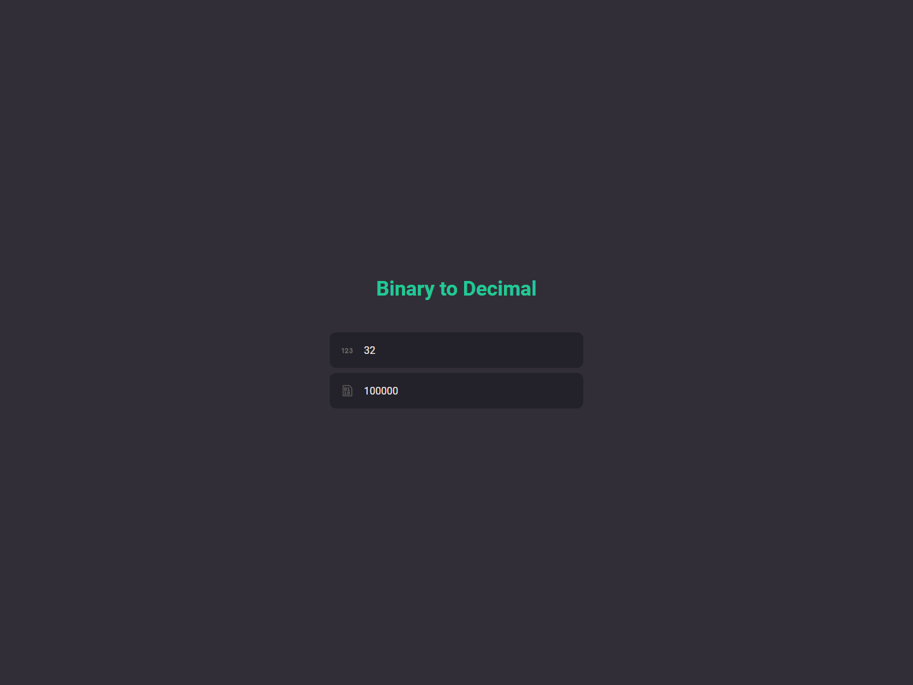

<h1 align="center">
 
Bin2Dec
</h1>

Project that transform decimal value to binary and binary to decimal.

  

  

## Features

- User can enter up to 8 binary digits in one input field
- User must be notified if anything other than a 0 or 1 was entered
- User views the results in a single output field containing the decimal (base 10) equivalent of the binary number that was entered
- User can enter a variable number of binary digits

- ⚛️ **React Js** — A JavaScript library for building user interfaces

## Getting started

- Clone project > enter the project folder
- run `yarn`
- run `yarn start`

## License

This project is licensed under the MIT License - see the [LICENSE](https://opensource.org/licenses/MIT) page for details.

---

Created with passion by me 👨🏻‍💻
